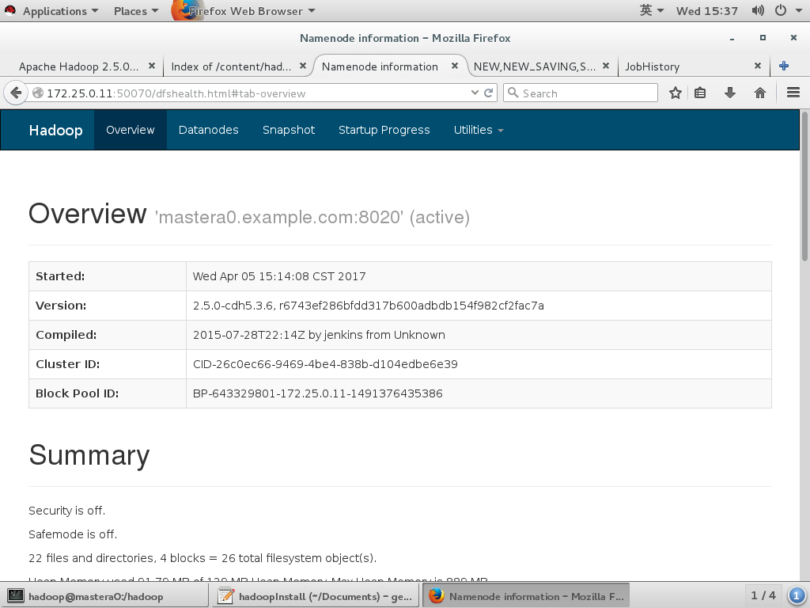
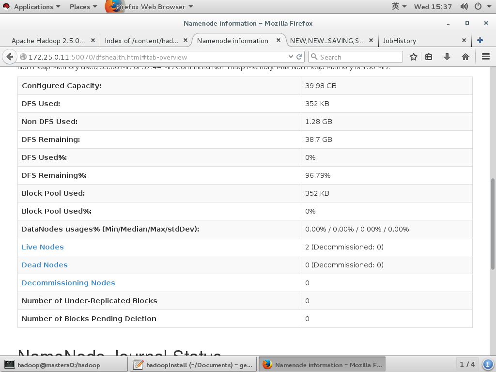
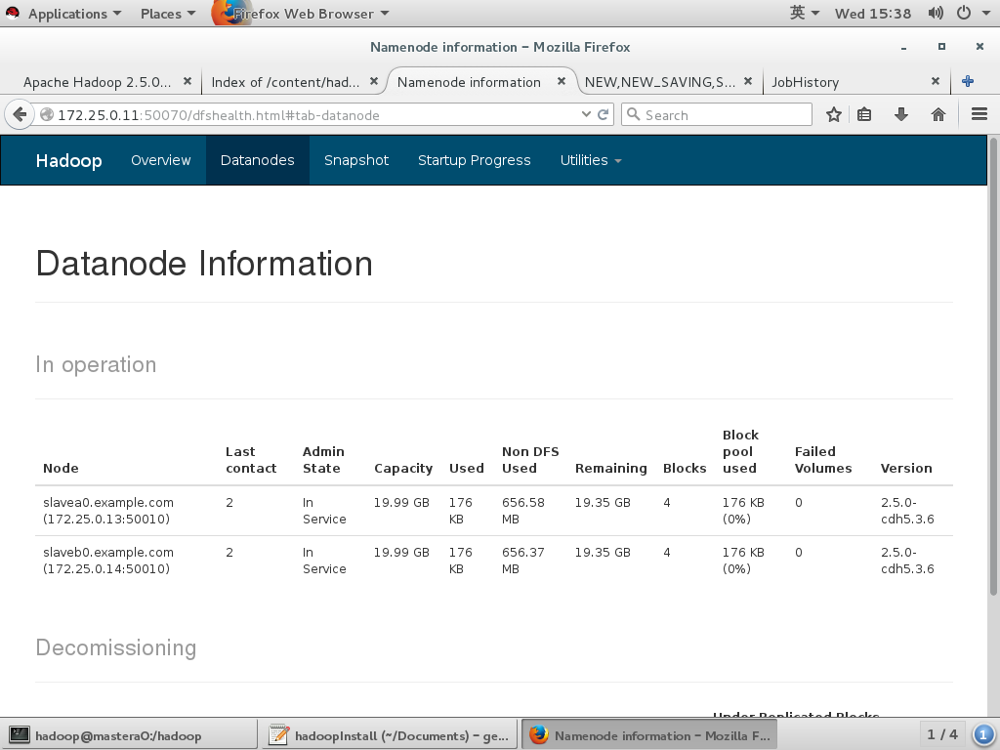
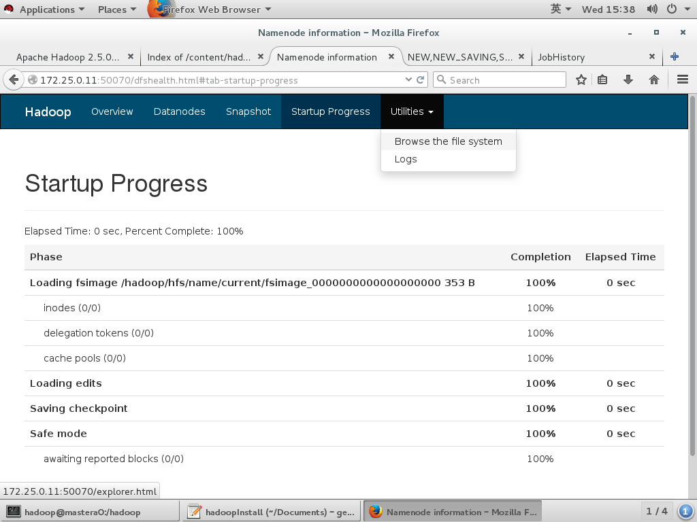
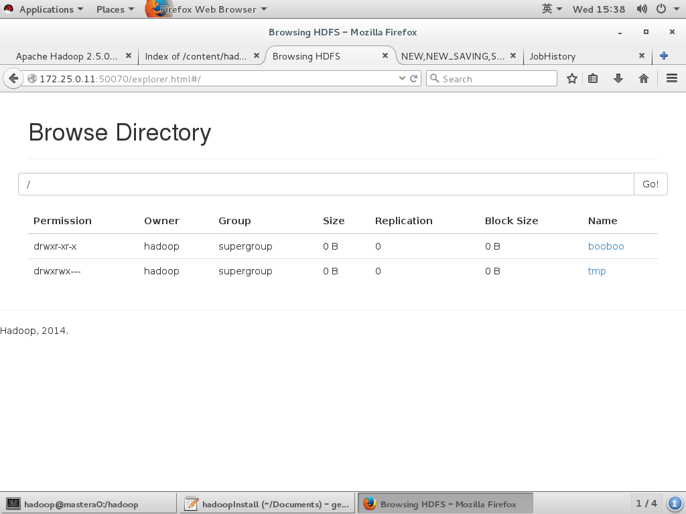
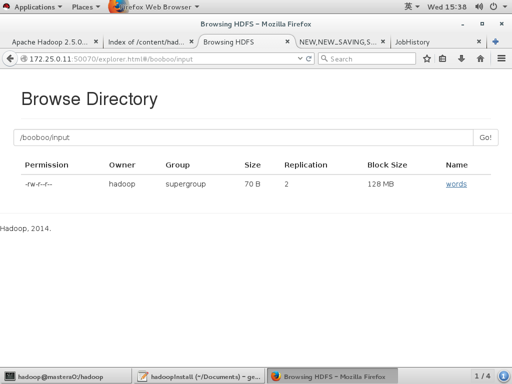
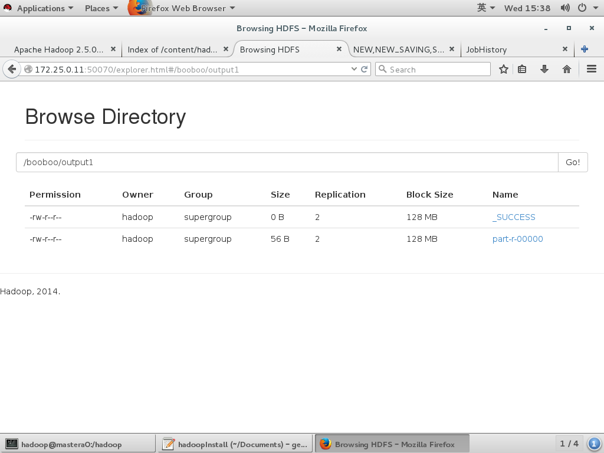
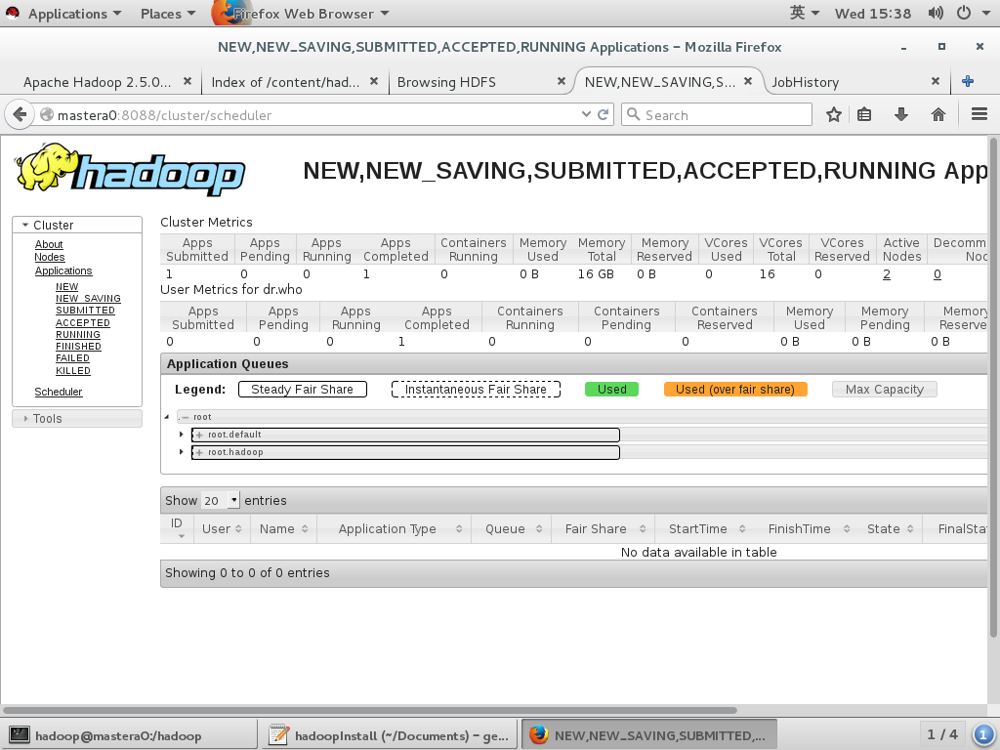
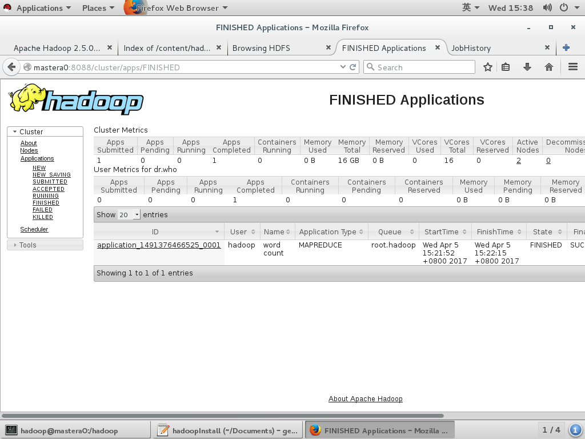
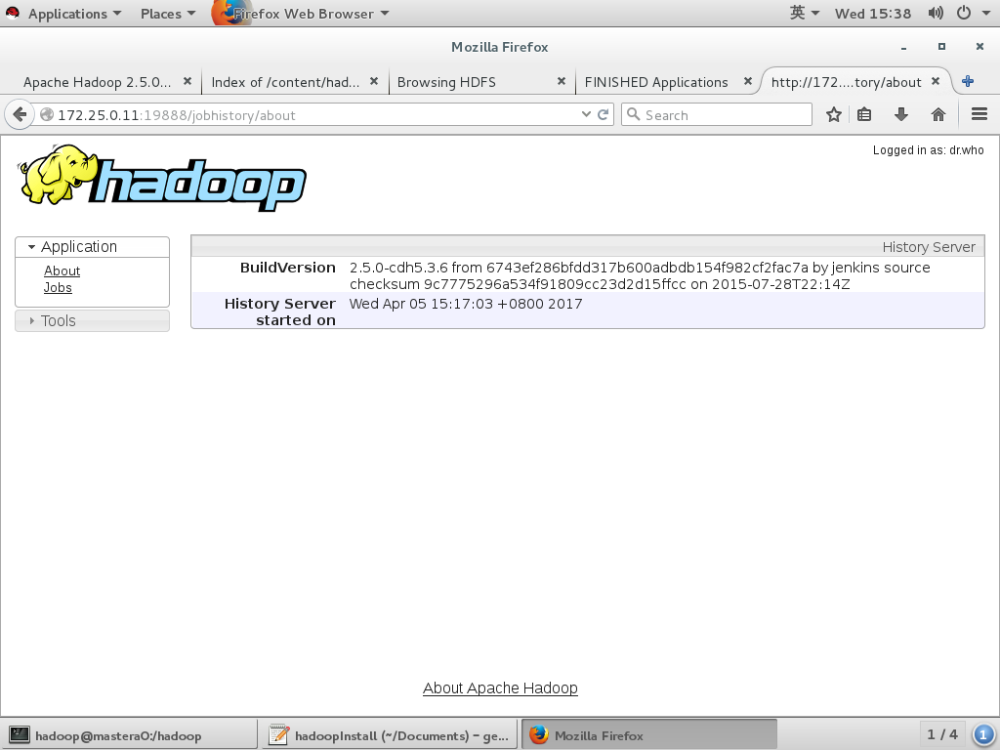

# Hadoop Install & wordcount test

## 环境介绍

OS:rhel7.2

mastera	172.25.0.11 nameserver(8020 50070) 	resourcemanager（8032 8030 8088 8031 8033 ）jobhistory(10020 19888)	

slavea	172.25.0.13 datanode   		nodemanager

slaveb 	172.25.0.14 datanode		nodemanager

## 初始化环境脚本

```shell
#!/bin/bash

A1(){
	# 对root用户创建无密钥登陆
	for i in 11 13 14;do ssh-copy-id root@172.25.0.$i;done
}

A2(){
	# 虚拟机创建hadoop用户密码为uplooking
	# 虚拟机安装vim wget net-tools
	# 真机将公钥拷贝到虚拟机
	# 虚拟机hadoop用户新建公钥私钥

	for i in 11 13 14
	do 
		ssh root@172.25.0.$i "useradd hadoop ; echo uplooking|passwd --stdin hadoop ; yum install -y 	vim net-tools wget ;systemctl stop firewalld ; setenforce 0;sed -i 's/SELINUX=enforcing/SELINUX=disabled/' /etc/selinux/config"
		ssh-copy-id hadoop@172.25.0.$i
	done
}

A3(){
	# 虚拟机之间无密钥访问，包括自己
	for i in 11 13 14
	do 
		ssh hadoop@172.25.0.$i "ssh-keygen"
	done

	# 将虚拟机的公钥保存到真机的tmp.txt中
	(for i in 11 13 14;do ssh hadoop@172.25.0.$i "cat /home/hadoop/.ssh/id_rsa.pub";done )> tmp.txt
	# 将保存所有虚拟机公钥的文件复制到虚拟机中，并追加到authorized_keys文件中
	for i in 11 13 14
	do 
		scp tmp.txt  hadoop@172.25.0.$i:~ 
		ssh hadoop@172.25.0.$i "cat ~/tmp.txt >> /home/hadoop/.ssh/authorized_keys"
	done
	# mastera虚拟机访问自己会产生known_hosts
	ssh hadoop@172.25.0.11 "ssh hadoop@172.25.0.11;cat ~/.ssh/known_hosts" > known_hosts.tmp
	# 根据known_hosts去写所有虚拟机的known_hosts并保存在真机的known_hosts.tmp文件中
	cat > known_hosts.tmp << ENDF
172.25.0.11 ecdsa-sha2-nistp256 AAAAE2VjZHNhLXNoYTItbmlzdHAyNTYAAAAIbmlzdHAyNTYAAABBBL58xGGAGvl4PmE+QXczZ4zmj0OEaaC/jLB0VmiO8ICCIzH825NZrQCWEJAvx+WwEQY7T0cGSvDUzoXOcjr/81c=
172.25.0.13 ecdsa-sha2-nistp256 AAAAE2VjZHNhLXNoYTItbmlzdHAyNTYAAAAIbmlzdHAyNTYAAABBBL58xGGAGvl4PmE+QXczZ4zmj0OEaaC/jLB0VmiO8ICCIzH825NZrQCWEJAvx+WwEQY7T0cGSvDUzoXOcjr/81c=
172.25.0.14 ecdsa-sha2-nistp256 AAAAE2VjZHNhLXNoYTItbmlzdHAyNTYAAAAIbmlzdHAyNTYAAABBBL58xGGAGvl4PmE+QXczZ4zmj0OEaaC/jLB0VmiO8ICCIzH825NZrQCWEJAvx+WwEQY7T0cGSvDUzoXOcjr/81c=
ENDF
	# 将临时文件拷贝到虚拟机即可
	for i in 11 13 14;do scp known_hosts.tmp  hadoop@172.25.0.$i:~ ;done
}


A4(){
	# 创建文件系统给hadoop使用 20G /hadoop
	cat > hadoop_file.sh << endfile
#!/bin/bash
cat > fdisk.tmp << ENDF
n
p
1
2048
41943039
w
ENDF

fdisk /dev/vdb < fdisk.tmp
mkfs.xfs /dev/vdb1
mkdir /hadoop
mount /dev/vdb1 /hadoop
chown hadoop. /hadoop/ -R
cat >> /etc/fstab << ENDF
/dev/vdb1 		/hadoop  		xfs	defaults        0 0
ENDF
mount -a
endfile

	for i in 11 13 14
	do 
		scp hadoop_file.sh  root@172.25.0.$i:~
		ssh  root@172.25.0.$i "bash hadoop_file.sh"
	done
}

A5(){
	# 下载hadoop的安装包
	ssh hadoop@172.25.0.11 "cd /hadoop ; wget http://classroom.example.com/content/hadoop/cdb5.tar ;wget http://classroom.example.com/content/hadoop/jdk.tar"
}

main(){
A1
A2
A3
A4
A5
}

main
```

## Install JDK & Hadoop


```shell
#!/bin/bash

# 以下操作在mastera上执行
B1(){
	# 解压缩
	cd /hadoop
	tar -xf jdk.tar 
	tar -xf cdb5.tar
	rm -rf jdk.tar
	rm -rf cdb5.tar
	rm -rf jdk/jdk-7u79-windows-x64.exe
	cd jdk
	tar -xf jdk-7u79-linux-x64.tar.gz
	rm -rf jdk-7u79-linux-x64.tar.gz
	cd /hadoop/cdb5/
	tar -xf hadoop-2.5.0-cdh5.3.6.tar.gz -C /hadoop
	# 安装jdk并宣告java家目录
	mv /hadoop/jdk /usr/local/
	echo "export JAVA_HOME=/usr/local/jdk/jdk1.7.0_79/" >> /etc/bashrc
	# 安装hadoop，添加hadoop家目录和可执行路径
	echo "export HD_HOME=/hadoop/hadoop-2.5.0-cdh5.3.6" >> /etc/bashrc
	echo "export PATH=${PATH}:${HD_HOME}/bin:${HD_HOME}/sbin:${JAVA_HOME}/bin" >> /etc/bashrc
	source /etc/bashrc
}

B1
```

## Hadoop配置文件

* core-site.xml模板 	share/doc/hadoop-project-dist/hadoop-common/core-default.xml
* hdfs-site.xml模板	share/doc/hadoop-project-dist/hadoop-hdfs/hdfs-default.xml
* yarn-site.xml模板 	share/doc/hadoop-yarn/hadoop-yarn-common/yarn-default.xml
* mapred-site.xml模板	share/doc/hadoop-mapreduce-client/hadoop-mapreduce-client-core/mapred-default.xml


列出核心内容

```shell
B2(){
	# 集群的配置文件
	cd ${HD_HOME}/etc/hadoop
	cat > core-site.xml << ENDF
<?xml-stylesheet type="text/xsl" href="configuration.xsl"?>
<configuration>
  <property>
    <name>fs.defaultFS</name>
    <value>hdfs://172.25.0.11:8020</value>
  </property>
</configuration>
ENDF

	cat > hdfs-site.xml << ENDF
<?xml version="1.0" encoding="UTF-8"?>
<?xml-stylesheet type="text/xsl" href="configuration.xsl"?>
<configuration>
  <property>
    <name>dfs.namenode.name.dir</name>
    <value>file:/hadoop/hfs/name</value>
  </property>
  <property>
    <name>dfs.datanode.data.dir</name>
    <value>file:/hadoop/hfs/data</value>
  </property>  
  <property>
    <name>dfs.replication</name>
    <value>2</value>
  </property>
</configuration>
ENDF
}

yarn-site.xml 中注意两点
yarn.resourcemanager.hostname=172.25.0.11
yarn.nodemanager.aux-services=mapreduce_shuffle

mapred-site.xml
mapreduce.framework.name=yarn

echo mastera0 > masters
echo slavea0 > slaves
echo slaveb0 >> slaves

}


C1(){
for i in 13 14 ; do scp -r  root@172.25.0.11:/usr/local/jdk root@172.25.0.$i:/usr/local;done
for i in 13 14 ; do scp -r  hadoop@172.25.0.11:/hadoop/hadoop-2.5.0-cdh5.3.6 hadoop@172.25.0.$i:/hadoop;done
for i in 11 13 14 ; do ssh root@172.25.0.$i "chown hadoop. /hadoop -R";done
for i in 13 14 ; do scp -r  root@172.25.0.11:/etc/bashrc root@172.25.0.$i:/etc/bashrc;done
}

B1
B2
C1
}

## wordcount 测试

```shell
# 格式化namenode
hdfs namenode -format

# 启动hdfs和mapreduce（yarn）
start-dfs.sh
sbin/start-yarn.sh

# start-all.sh

# 启动hisotryserver
#sbin/mr-jobhistory-daemon.sh stop historyserver
sbin/mr-jobhistory-daemon.sh start historyserver

# 查看java进程
jps

# 第归创建测试目录
hdfs dfs -mkdir -p /booboo/input

# 将单词文件放入测试目录
cat> words << ENDF
hello tom
hello jack
hello superman
superman is me
batman vs superman
ENDF

hdfs dfs -put words /booboo/input

# 开始测试，并将结果输出到制定目录
yarn jar hadoop-2.5.0-cdh5.3.6/share/hadoop/mapreduce/hadoop-mapreduce-examples-2.5.0-cdh5.3.6.jar wordcount /booboo/input /booboo/output1
```

## 详细操作留档

```shell
[hadoop@mastera0 ~]$ hdfs namenode -format
17/04/05 14:48:22 INFO namenode.NameNode: STARTUP_MSG: 
/************************************************************
STARTUP_MSG: Starting NameNode
STARTUP_MSG:   host = mastera0.example.com/172.25.0.11
STARTUP_MSG:   args = [-format]
STARTUP_MSG:   version = 2.5.0-cdh5.3.6
STARTUP_MSG:   classpath = /hadoop/hadoop-2.5.0-cdh5.3.6/etc/hadoop:/hadoop/hadoop-2.5.0-cdh5.3.6/share/hadoop/common/lib/commons-cli-1.2.jar:/hadoop/hadoop-2.5.0-cdh5.3.6/share/hadoop/common/lib/guava-11.0.2.jar:/hadoop/hadoop-2.5.0-cdh5.3.6/share/hadoop/common/lib/snappy-java-1.0.4.1.jar:/hadoop/hadoop-2.5.0-cdh5.3.6/share/hadoop/common/lib/jsch-0.1.42.jar:/hadoop/hadoop-2.5.0-cdh5.3.6/share/hadoop/common/lib/commons-digester-1.8.jar:/hadoop/hadoop-2.5.0-cdh5.3.6/share/hadoop/common/lib/slf4j-api-1.7.5.jar:/hadoop/hadoop-2.5.0-cdh5.3.6/share/hadoop/common/lib/jets3t-0.9.0.jar:/hadoop/hadoop-2.5.0-cdh5.3.6/share/hadoop/common/lib/commons-logging-1.1.3.jar:/hadoop/hadoop-2.5.0-cdh5.3.6/share/hadoop/common/lib/apacheds-kerberos-codec-2.0.0-M15.jar:/hadoop/hadoop-2.5.0-cdh5.3.6/share/hadoop/common/lib/commons-configuration-1.6.jar:/hadoop/hadoop-2.5.0-cdh5.3.6/share/hadoop/common/lib/commons-compress-1.4.1.jar:/hadoop/hadoop-2.5.0-cdh5.3.6/share/hadoop/common/lib/xz-1.0.jar:/hadoop/hadoop-2.5.0-cdh5.3.6/share/hadoop/common/lib/jettison-1.1.jar:/hadoop/hadoop-2.5.0-cdh5.3.6/share/hadoop/common/lib/jetty-util-6.1.26.cloudera.4.jar:/hadoop/hadoop-2.5.0-cdh5.3.6/share/hadoop/common/lib/httpcore-4.2.5.jar:/hadoop/hadoop-2.5.0-cdh5.3.6/share/hadoop/common/lib/protobuf-java-2.5.0.jar:/hadoop/hadoop-2.5.0-cdh5.3.6/share/hadoop/common/lib/netty-3.6.2.Final.jar:/hadoop/hadoop-2.5.0-cdh5.3.6/share/hadoop/common/lib/commons-math3-3.1.1.jar:/hadoop/hadoop-2.5.0-cdh5.3.6/share/hadoop/common/lib/api-asn1-api-1.0.0-M20.jar:/hadoop/hadoop-2.5.0-cdh5.3.6/share/hadoop/common/lib/jsp-api-2.1.jar:/hadoop/hadoop-2.5.0-cdh5.3.6/share/hadoop/common/lib/commons-collections-3.2.1.jar:/hadoop/hadoop-2.5.0-cdh5.3.6/share/hadoop/common/lib/xmlenc-0.52.jar:/hadoop/hadoop-2.5.0-cdh5.3.6/share/hadoop/common/lib/jasper-compiler-5.5.23.jar:/hadoop/hadoop-2.5.0-cdh5.3.6/share/hadoop/common/lib/jersey-core-1.9.jar:/hadoop/hadoop-2.5.0-cdh5.3.6/share/hadoop/common/lib/commons-httpclient-3.1.jar:/hadoop/hadoop-2.5.0-cdh5.3.6/share/hadoop/common/lib/jackson-core-asl-1.8.8.jar:/hadoop/hadoop-2.5.0-cdh5.3.6/share/hadoop/common/lib/slf4j-log4j12-1.7.5.jar:/hadoop/hadoop-2.5.0-cdh5.3.6/share/hadoop/common/lib/asm-3.2.jar:/hadoop/hadoop-2.5.0-cdh5.3.6/share/hadoop/common/lib/commons-el-1.0.jar:/hadoop/hadoop-2.5.0-cdh5.3.6/share/hadoop/common/lib/commons-codec-1.4.jar:/hadoop/hadoop-2.5.0-cdh5.3.6/share/hadoop/common/lib/jersey-json-1.9.jar:/hadoop/hadoop-2.5.0-cdh5.3.6/share/hadoop/common/lib/commons-lang-2.6.jar:/hadoop/hadoop-2.5.0-cdh5.3.6/share/hadoop/common/lib/stax-api-1.0-2.jar:/hadoop/hadoop-2.5.0-cdh5.3.6/share/hadoop/common/lib/curator-framework-2.6.0.jar:/hadoop/hadoop-2.5.0-cdh5.3.6/share/hadoop/common/lib/jaxb-impl-2.2.3-1.jar:/hadoop/hadoop-2.5.0-cdh5.3.6/share/hadoop/common/lib/hadoop-auth-2.5.0-cdh5.3.6.jar:/hadoop/hadoop-2.5.0-cdh5.3.6/share/hadoop/common/lib/jasper-runtime-5.5.23.jar:/hadoop/hadoop-2.5.0-cdh5.3.6/share/hadoop/common/lib/jackson-xc-1.8.8.jar:/hadoop/hadoop-2.5.0-cdh5.3.6/share/hadoop/common/lib/api-util-1.0.0-M20.jar:/hadoop/hadoop-2.5.0-cdh5.3.6/share/hadoop/common/lib/jackson-mapper-asl-1.8.8.jar:/hadoop/hadoop-2.5.0-cdh5.3.6/share/hadoop/common/lib/jaxb-api-2.2.2.jar:/hadoop/hadoop-2.5.0-cdh5.3.6/share/hadoop/common/lib/curator-recipes-2.6.0.jar:/hadoop/hadoop-2.5.0-cdh5.3.6/share/hadoop/common/lib/commons-beanutils-1.7.0.jar:/hadoop/hadoop-2.5.0-cdh5.3.6/share/hadoop/common/lib/jsr305-1.3.9.jar:/hadoop/hadoop-2.5.0-cdh5.3.6/share/hadoop/common/lib/hamcrest-core-1.3.jar:/hadoop/hadoop-2.5.0-cdh5.3.6/share/hadoop/common/lib/gson-2.2.4.jar:/hadoop/hadoop-2.5.0-cdh5.3.6/share/hadoop/common/lib/paranamer-2.3.jar:/hadoop/hadoop-2.5.0-cdh5.3.6/share/hadoop/common/lib/avro-1.7.6-cdh5.3.6.jar:/hadoop/hadoop-2.5.0-cdh5.3.6/share/hadoop/common/lib/apacheds-i18n-2.0.0-M15.jar:/hadoop/hadoop-2.5.0-cdh5.3.6/share/hadoop/common/lib/commons-net-3.1.jar:/hadoop/hadoop-2.5.0-cdh5.3.6/share/hadoop/common/lib/junit-4.11.jar:/hadoop/hadoop-2.5.0-cdh5.3.6/share/hadoop/common/lib/java-xmlbuilder-0.4.jar:/hadoop/hadoop-2.5.0-cdh5.3.6/share/hadoop/common/lib/commons-beanutils-core-1.8.0.jar:/hadoop/hadoop-2.5.0-cdh5.3.6/share/hadoop/common/lib/mockito-all-1.8.5.jar:/hadoop/hadoop-2.5.0-cdh5.3.6/share/hadoop/common/lib/activation-1.1.jar:/hadoop/hadoop-2.5.0-cdh5.3.6/share/hadoop/common/lib/servlet-api-2.5.jar:/hadoop/hadoop-2.5.0-cdh5.3.6/share/hadoop/common/lib/hadoop-annotations-2.5.0-cdh5.3.6.jar:/hadoop/hadoop-2.5.0-cdh5.3.6/share/hadoop/common/lib/jersey-server-1.9.jar:/hadoop/hadoop-2.5.0-cdh5.3.6/share/hadoop/common/lib/httpclient-4.2.5.jar:/hadoop/hadoop-2.5.0-cdh5.3.6/share/hadoop/common/lib/log4j-1.2.17.jar:/hadoop/hadoop-2.5.0-cdh5.3.6/share/hadoop/common/lib/zookeeper-3.4.5-cdh5.3.6.jar:/hadoop/hadoop-2.5.0-cdh5.3.6/share/hadoop/common/lib/jackson-jaxrs-1.8.8.jar:/hadoop/hadoop-2.5.0-cdh5.3.6/share/hadoop/common/lib/curator-client-2.6.0.jar:/hadoop/hadoop-2.5.0-cdh5.3.6/share/hadoop/common/lib/jetty-6.1.26.cloudera.4.jar:/hadoop/hadoop-2.5.0-cdh5.3.6/share/hadoop/common/lib/commons-io-2.4.jar:/hadoop/hadoop-2.5.0-cdh5.3.6/share/hadoop/common/hadoop-common-2.5.0-cdh5.3.6.jar:/hadoop/hadoop-2.5.0-cdh5.3.6/share/hadoop/common/hadoop-nfs-2.5.0-cdh5.3.6.jar:/hadoop/hadoop-2.5.0-cdh5.3.6/share/hadoop/common/hadoop-common-2.5.0-cdh5.3.6-tests.jar:/hadoop/hadoop-2.5.0-cdh5.3.6/share/hadoop/hdfs:/hadoop/hadoop-2.5.0-cdh5.3.6/share/hadoop/hdfs/lib/commons-cli-1.2.jar:/hadoop/hadoop-2.5.0-cdh5.3.6/share/hadoop/hdfs/lib/guava-11.0.2.jar:/hadoop/hadoop-2.5.0-cdh5.3.6/share/hadoop/hdfs/lib/commons-logging-1.1.3.jar:/hadoop/hadoop-2.5.0-cdh5.3.6/share/hadoop/hdfs/lib/jetty-util-6.1.26.cloudera.4.jar:/hadoop/hadoop-2.5.0-cdh5.3.6/share/hadoop/hdfs/lib/protobuf-java-2.5.0.jar:/hadoop/hadoop-2.5.0-cdh5.3.6/share/hadoop/hdfs/lib/netty-3.6.2.Final.jar:/hadoop/hadoop-2.5.0-cdh5.3.6/share/hadoop/hdfs/lib/jsp-api-2.1.jar:/hadoop/hadoop-2.5.0-cdh5.3.6/share/hadoop/hdfs/lib/xmlenc-0.52.jar:/hadoop/hadoop-2.5.0-cdh5.3.6/share/hadoop/hdfs/lib/jersey-core-1.9.jar:/hadoop/hadoop-2.5.0-cdh5.3.6/share/hadoop/hdfs/lib/jackson-core-asl-1.8.8.jar:/hadoop/hadoop-2.5.0-cdh5.3.6/share/hadoop/hdfs/lib/asm-3.2.jar:/hadoop/hadoop-2.5.0-cdh5.3.6/share/hadoop/hdfs/lib/commons-el-1.0.jar:/hadoop/hadoop-2.5.0-cdh5.3.6/share/hadoop/hdfs/lib/commons-codec-1.4.jar:/hadoop/hadoop-2.5.0-cdh5.3.6/share/hadoop/hdfs/lib/commons-lang-2.6.jar:/hadoop/hadoop-2.5.0-cdh5.3.6/share/hadoop/hdfs/lib/jasper-runtime-5.5.23.jar:/hadoop/hadoop-2.5.0-cdh5.3.6/share/hadoop/hdfs/lib/jackson-mapper-asl-1.8.8.jar:/hadoop/hadoop-2.5.0-cdh5.3.6/share/hadoop/hdfs/lib/jsr305-1.3.9.jar:/hadoop/hadoop-2.5.0-cdh5.3.6/share/hadoop/hdfs/lib/commons-daemon-1.0.13.jar:/hadoop/hadoop-2.5.0-cdh5.3.6/share/hadoop/hdfs/lib/servlet-api-2.5.jar:/hadoop/hadoop-2.5.0-cdh5.3.6/share/hadoop/hdfs/lib/jersey-server-1.9.jar:/hadoop/hadoop-2.5.0-cdh5.3.6/share/hadoop/hdfs/lib/log4j-1.2.17.jar:/hadoop/hadoop-2.5.0-cdh5.3.6/share/hadoop/hdfs/lib/jetty-6.1.26.cloudera.4.jar:/hadoop/hadoop-2.5.0-cdh5.3.6/share/hadoop/hdfs/lib/commons-io-2.4.jar:/hadoop/hadoop-2.5.0-cdh5.3.6/share/hadoop/hdfs/hadoop-hdfs-nfs-2.5.0-cdh5.3.6.jar:/hadoop/hadoop-2.5.0-cdh5.3.6/share/hadoop/hdfs/hadoop-hdfs-2.5.0-cdh5.3.6-tests.jar:/hadoop/hadoop-2.5.0-cdh5.3.6/share/hadoop/hdfs/hadoop-hdfs-2.5.0-cdh5.3.6.jar:/hadoop/hadoop-2.5.0-cdh5.3.6/share/hadoop/yarn/lib/jline-0.9.94.jar:/hadoop/hadoop-2.5.0-cdh5.3.6/share/hadoop/yarn/lib/commons-cli-1.2.jar:/hadoop/hadoop-2.5.0-cdh5.3.6/share/hadoop/yarn/lib/guava-11.0.2.jar:/hadoop/hadoop-2.5.0-cdh5.3.6/share/hadoop/yarn/lib/commons-logging-1.1.3.jar:/hadoop/hadoop-2.5.0-cdh5.3.6/share/hadoop/yarn/lib/commons-compress-1.4.1.jar:/hadoop/hadoop-2.5.0-cdh5.3.6/share/hadoop/yarn/lib/xz-1.0.jar:/hadoop/hadoop-2.5.0-cdh5.3.6/share/hadoop/yarn/lib/jettison-1.1.jar:/hadoop/hadoop-2.5.0-cdh5.3.6/share/hadoop/yarn/lib/jetty-util-6.1.26.cloudera.4.jar:/hadoop/hadoop-2.5.0-cdh5.3.6/share/hadoop/yarn/lib/protobuf-java-2.5.0.jar:/hadoop/hadoop-2.5.0-cdh5.3.6/share/hadoop/yarn/lib/jersey-client-1.9.jar:/hadoop/hadoop-2.5.0-cdh5.3.6/share/hadoop/yarn/lib/commons-collections-3.2.1.jar:/hadoop/hadoop-2.5.0-cdh5.3.6/share/hadoop/yarn/lib/jersey-core-1.9.jar:/hadoop/hadoop-2.5.0-cdh5.3.6/share/hadoop/yarn/lib/commons-httpclient-3.1.jar:/hadoop/hadoop-2.5.0-cdh5.3.6/share/hadoop/yarn/lib/jackson-core-asl-1.8.8.jar:/hadoop/hadoop-2.5.0-cdh5.3.6/share/hadoop/yarn/lib/asm-3.2.jar:/hadoop/hadoop-2.5.0-cdh5.3.6/share/hadoop/yarn/lib/commons-codec-1.4.jar:/hadoop/hadoop-2.5.0-cdh5.3.6/share/hadoop/yarn/lib/jersey-json-1.9.jar:/hadoop/hadoop-2.5.0-cdh5.3.6/share/hadoop/yarn/lib/commons-lang-2.6.jar:/hadoop/hadoop-2.5.0-cdh5.3.6/share/hadoop/yarn/lib/stax-api-1.0-2.jar:/hadoop/hadoop-2.5.0-cdh5.3.6/share/hadoop/yarn/lib/jaxb-impl-2.2.3-1.jar:/hadoop/hadoop-2.5.0-cdh5.3.6/share/hadoop/yarn/lib/guice-3.0.jar:/hadoop/hadoop-2.5.0-cdh5.3.6/share/hadoop/yarn/lib/javax.inject-1.jar:/hadoop/hadoop-2.5.0-cdh5.3.6/share/hadoop/yarn/lib/jackson-xc-1.8.8.jar:/hadoop/hadoop-2.5.0-cdh5.3.6/share/hadoop/yarn/lib/jersey-guice-1.9.jar:/hadoop/hadoop-2.5.0-cdh5.3.6/share/hadoop/yarn/lib/jackson-mapper-asl-1.8.8.jar:/hadoop/hadoop-2.5.0-cdh5.3.6/share/hadoop/yarn/lib/jaxb-api-2.2.2.jar:/hadoop/hadoop-2.5.0-cdh5.3.6/share/hadoop/yarn/lib/jsr305-1.3.9.jar:/hadoop/hadoop-2.5.0-cdh5.3.6/share/hadoop/yarn/lib/leveldbjni-all-1.8.jar:/hadoop/hadoop-2.5.0-cdh5.3.6/share/hadoop/yarn/lib/activation-1.1.jar:/hadoop/hadoop-2.5.0-cdh5.3.6/share/hadoop/yarn/lib/servlet-api-2.5.jar:/hadoop/hadoop-2.5.0-cdh5.3.6/share/hadoop/yarn/lib/jersey-server-1.9.jar:/hadoop/hadoop-2.5.0-cdh5.3.6/share/hadoop/yarn/lib/guice-servlet-3.0.jar:/hadoop/hadoop-2.5.0-cdh5.3.6/share/hadoop/yarn/lib/log4j-1.2.17.jar:/hadoop/hadoop-2.5.0-cdh5.3.6/share/hadoop/yarn/lib/zookeeper-3.4.5-cdh5.3.6.jar:/hadoop/hadoop-2.5.0-cdh5.3.6/share/hadoop/yarn/lib/aopalliance-1.0.jar:/hadoop/hadoop-2.5.0-cdh5.3.6/share/hadoop/yarn/lib/jackson-jaxrs-1.8.8.jar:/hadoop/hadoop-2.5.0-cdh5.3.6/share/hadoop/yarn/lib/jetty-6.1.26.cloudera.4.jar:/hadoop/hadoop-2.5.0-cdh5.3.6/share/hadoop/yarn/lib/commons-io-2.4.jar:/hadoop/hadoop-2.5.0-cdh5.3.6/share/hadoop/yarn/hadoop-yarn-server-applicationhistoryservice-2.5.0-cdh5.3.6.jar:/hadoop/hadoop-2.5.0-cdh5.3.6/share/hadoop/yarn/hadoop-yarn-server-resourcemanager-2.5.0-cdh5.3.6.jar:/hadoop/hadoop-2.5.0-cdh5.3.6/share/hadoop/yarn/hadoop-yarn-client-2.5.0-cdh5.3.6.jar:/hadoop/hadoop-2.5.0-cdh5.3.6/share/hadoop/yarn/hadoop-yarn-applications-distributedshell-2.5.0-cdh5.3.6.jar:/hadoop/hadoop-2.5.0-cdh5.3.6/share/hadoop/yarn/hadoop-yarn-common-2.5.0-cdh5.3.6.jar:/hadoop/hadoop-2.5.0-cdh5.3.6/share/hadoop/yarn/hadoop-yarn-server-web-proxy-2.5.0-cdh5.3.6.jar:/hadoop/hadoop-2.5.0-cdh5.3.6/share/hadoop/yarn/hadoop-yarn-applications-unmanaged-am-launcher-2.5.0-cdh5.3.6.jar:/hadoop/hadoop-2.5.0-cdh5.3.6/share/hadoop/yarn/hadoop-yarn-api-2.5.0-cdh5.3.6.jar:/hadoop/hadoop-2.5.0-cdh5.3.6/share/hadoop/yarn/hadoop-yarn-server-nodemanager-2.5.0-cdh5.3.6.jar:/hadoop/hadoop-2.5.0-cdh5.3.6/share/hadoop/yarn/hadoop-yarn-server-common-2.5.0-cdh5.3.6.jar:/hadoop/hadoop-2.5.0-cdh5.3.6/share/hadoop/yarn/hadoop-yarn-server-tests-2.5.0-cdh5.3.6.jar:/hadoop/hadoop-2.5.0-cdh5.3.6/share/hadoop/mapreduce/lib/snappy-java-1.0.4.1.jar:/hadoop/hadoop-2.5.0-cdh5.3.6/share/hadoop/mapreduce/lib/commons-compress-1.4.1.jar:/hadoop/hadoop-2.5.0-cdh5.3.6/share/hadoop/mapreduce/lib/xz-1.0.jar:/hadoop/hadoop-2.5.0-cdh5.3.6/share/hadoop/mapreduce/lib/protobuf-java-2.5.0.jar:/hadoop/hadoop-2.5.0-cdh5.3.6/share/hadoop/mapreduce/lib/netty-3.6.2.Final.jar:/hadoop/hadoop-2.5.0-cdh5.3.6/share/hadoop/mapreduce/lib/jersey-core-1.9.jar:/hadoop/hadoop-2.5.0-cdh5.3.6/share/hadoop/mapreduce/lib/jackson-core-asl-1.8.8.jar:/hadoop/hadoop-2.5.0-cdh5.3.6/share/hadoop/mapreduce/lib/asm-3.2.jar:/hadoop/hadoop-2.5.0-cdh5.3.6/share/hadoop/mapreduce/lib/guice-3.0.jar:/hadoop/hadoop-2.5.0-cdh5.3.6/share/hadoop/mapreduce/lib/javax.inject-1.jar:/hadoop/hadoop-2.5.0-cdh5.3.6/share/hadoop/mapreduce/lib/jersey-guice-1.9.jar:/hadoop/hadoop-2.5.0-cdh5.3.6/share/hadoop/mapreduce/lib/jackson-mapper-asl-1.8.8.jar:/hadoop/hadoop-2.5.0-cdh5.3.6/share/hadoop/mapreduce/lib/hamcrest-core-1.3.jar:/hadoop/hadoop-2.5.0-cdh5.3.6/share/hadoop/mapreduce/lib/paranamer-2.3.jar:/hadoop/hadoop-2.5.0-cdh5.3.6/share/hadoop/mapreduce/lib/avro-1.7.6-cdh5.3.6.jar:/hadoop/hadoop-2.5.0-cdh5.3.6/share/hadoop/mapreduce/lib/junit-4.11.jar:/hadoop/hadoop-2.5.0-cdh5.3.6/share/hadoop/mapreduce/lib/leveldbjni-all-1.8.jar:/hadoop/hadoop-2.5.0-cdh5.3.6/share/hadoop/mapreduce/lib/hadoop-annotations-2.5.0-cdh5.3.6.jar:/hadoop/hadoop-2.5.0-cdh5.3.6/share/hadoop/mapreduce/lib/jersey-server-1.9.jar:/hadoop/hadoop-2.5.0-cdh5.3.6/share/hadoop/mapreduce/lib/guice-servlet-3.0.jar:/hadoop/hadoop-2.5.0-cdh5.3.6/share/hadoop/mapreduce/lib/log4j-1.2.17.jar:/hadoop/hadoop-2.5.0-cdh5.3.6/share/hadoop/mapreduce/lib/aopalliance-1.0.jar:/hadoop/hadoop-2.5.0-cdh5.3.6/share/hadoop/mapreduce/lib/commons-io-2.4.jar:/hadoop/hadoop-2.5.0-cdh5.3.6/share/hadoop/mapreduce/hadoop-mapreduce-client-nativetask-2.5.0-cdh5.3.6.jar:/hadoop/hadoop-2.5.0-cdh5.3.6/share/hadoop/mapreduce/hadoop-mapreduce-client-jobclient-2.5.0-cdh5.3.6-tests.jar:/hadoop/hadoop-2.5.0-cdh5.3.6/share/hadoop/mapreduce/hadoop-mapreduce-examples-2.5.0-cdh5.3.6.jar:/hadoop/hadoop-2.5.0-cdh5.3.6/share/hadoop/mapreduce/hadoop-mapreduce-client-core-2.5.0-cdh5.3.6.jar:/hadoop/hadoop-2.5.0-cdh5.3.6/share/hadoop/mapreduce/hadoop-mapreduce-client-jobclient-2.5.0-cdh5.3.6.jar:/hadoop/hadoop-2.5.0-cdh5.3.6/share/hadoop/mapreduce/hadoop-mapreduce-client-hs-2.5.0-cdh5.3.6.jar:/hadoop/hadoop-2.5.0-cdh5.3.6/share/hadoop/mapreduce/hadoop-mapreduce-client-shuffle-2.5.0-cdh5.3.6.jar:/hadoop/hadoop-2.5.0-cdh5.3.6/share/hadoop/mapreduce/hadoop-mapreduce-client-hs-plugins-2.5.0-cdh5.3.6.jar:/hadoop/hadoop-2.5.0-cdh5.3.6/share/hadoop/mapreduce/hadoop-mapreduce-client-app-2.5.0-cdh5.3.6.jar:/hadoop/hadoop-2.5.0-cdh5.3.6/share/hadoop/mapreduce/hadoop-mapreduce-client-common-2.5.0-cdh5.3.6.jar:/contrib/capacity-scheduler/*.jar
STARTUP_MSG:   build = http://github.com/cloudera/hadoop -r 6743ef286bfdd317b600adbdb154f982cf2fac7a; compiled by 'jenkins' on 2015-07-28T22:14Z
STARTUP_MSG:   java = 1.7.0_79
************************************************************/
17/04/05 14:48:22 INFO namenode.NameNode: registered UNIX signal handlers for [TERM, HUP, INT]
17/04/05 14:48:22 INFO namenode.NameNode: createNameNode [-format]
17/04/05 14:48:23 WARN util.NativeCodeLoader: Unable to load native-hadoop library for your platform... using builtin-java classes where applicable
Formatting using clusterid: CID-954f4053-15e7-4bda-b7de-18f0cf9397f8
17/04/05 14:48:23 INFO namenode.FSNamesystem: No KeyProvider found.
17/04/05 14:48:23 INFO namenode.FSNamesystem: fsLock is fair:true
17/04/05 14:48:23 INFO blockmanagement.DatanodeManager: dfs.block.invalidate.limit=1000
17/04/05 14:48:23 INFO blockmanagement.DatanodeManager: dfs.namenode.datanode.registration.ip-hostname-check=true
17/04/05 14:48:23 INFO blockmanagement.BlockManager: dfs.namenode.startup.delay.block.deletion.sec is set to 000:00:00:00.000
17/04/05 14:48:23 INFO blockmanagement.BlockManager: The block deletion will start around 2017 Apr 05 14:48:23
17/04/05 14:48:23 INFO util.GSet: Computing capacity for map BlocksMap
17/04/05 14:48:23 INFO util.GSet: VM type       = 64-bit
17/04/05 14:48:23 INFO util.GSet: 2.0% max memory 889 MB = 17.8 MB
17/04/05 14:48:23 INFO util.GSet: capacity      = 2^21 = 2097152 entries
17/04/05 14:48:23 INFO blockmanagement.BlockManager: dfs.block.access.token.enable=false
17/04/05 14:48:23 INFO blockmanagement.BlockManager: defaultReplication         = 2
17/04/05 14:48:23 INFO blockmanagement.BlockManager: maxReplication             = 512
17/04/05 14:48:23 INFO blockmanagement.BlockManager: minReplication             = 1
17/04/05 14:48:23 INFO blockmanagement.BlockManager: maxReplicationStreams      = 2
17/04/05 14:48:23 INFO blockmanagement.BlockManager: shouldCheckForEnoughRacks  = false
17/04/05 14:48:23 INFO blockmanagement.BlockManager: replicationRecheckInterval = 3000
17/04/05 14:48:23 INFO blockmanagement.BlockManager: encryptDataTransfer        = false
17/04/05 14:48:23 INFO blockmanagement.BlockManager: maxNumBlocksToLog          = 1000
17/04/05 14:48:23 INFO namenode.FSNamesystem: fsOwner             = hadoop (auth:SIMPLE)
17/04/05 14:48:23 INFO namenode.FSNamesystem: supergroup          = supergroup
17/04/05 14:48:23 INFO namenode.FSNamesystem: isPermissionEnabled = true
17/04/05 14:48:23 INFO namenode.FSNamesystem: HA Enabled: false
17/04/05 14:48:23 INFO namenode.FSNamesystem: Append Enabled: true
17/04/05 14:48:24 INFO util.GSet: Computing capacity for map INodeMap
17/04/05 14:48:24 INFO util.GSet: VM type       = 64-bit
17/04/05 14:48:24 INFO util.GSet: 1.0% max memory 889 MB = 8.9 MB
17/04/05 14:48:24 INFO util.GSet: capacity      = 2^20 = 1048576 entries
17/04/05 14:48:24 INFO namenode.NameNode: Caching file names occuring more than 10 times
17/04/05 14:48:24 INFO util.GSet: Computing capacity for map cachedBlocks
17/04/05 14:48:24 INFO util.GSet: VM type       = 64-bit
17/04/05 14:48:24 INFO util.GSet: 0.25% max memory 889 MB = 2.2 MB
17/04/05 14:48:24 INFO util.GSet: capacity      = 2^18 = 262144 entries
17/04/05 14:48:24 INFO namenode.FSNamesystem: dfs.namenode.safemode.threshold-pct = 0.9990000128746033
17/04/05 14:48:24 INFO namenode.FSNamesystem: dfs.namenode.safemode.min.datanodes = 0
17/04/05 14:48:24 INFO namenode.FSNamesystem: dfs.namenode.safemode.extension     = 30000
17/04/05 14:48:24 INFO namenode.FSNamesystem: Retry cache on namenode is enabled
17/04/05 14:48:24 INFO namenode.FSNamesystem: Retry cache will use 0.03 of total heap and retry cache entry expiry time is 600000 millis
17/04/05 14:48:24 INFO util.GSet: Computing capacity for map NameNodeRetryCache
17/04/05 14:48:24 INFO util.GSet: VM type       = 64-bit
17/04/05 14:48:24 INFO util.GSet: 0.029999999329447746% max memory 889 MB = 273.1 KB
17/04/05 14:48:24 INFO util.GSet: capacity      = 2^15 = 32768 entries
17/04/05 14:48:24 INFO namenode.NNConf: ACLs enabled? false
17/04/05 14:48:24 INFO namenode.NNConf: XAttrs enabled? true
17/04/05 14:48:24 INFO namenode.NNConf: Maximum size of an xattr: 16384
17/04/05 14:48:24 INFO namenode.FSImage: Allocated new BlockPoolId: BP-885559910-172.25.0.11-1491374904248
17/04/05 14:48:24 INFO common.Storage: Storage directory /hadoop/hfs/name has been successfully formatted.
17/04/05 14:48:24 INFO namenode.NNStorageRetentionManager: Going to retain 1 images with txid >= 0
17/04/05 14:48:24 INFO util.ExitUtil: Exiting with status 0
17/04/05 14:48:24 INFO namenode.NameNode: SHUTDOWN_MSG: 
/************************************************************
SHUTDOWN_MSG: Shutting down NameNode at mastera0.example.com/172.25.0.11
************************************************************/

[hadoop@mastera0 hadoop]$ start-all.sh
[hadoop@mastera0 hadoop]$ mr-jobhistory-daemon.sh start historyserver
[hadoop@mastera0 hadoop]$ hdfs dfs -mkdir -p /booboo/input 
17/04/05 15:18:00 WARN util.NativeCodeLoader: Unable to load native-hadoop library for your platform... using builtin-java classes where applicable
[hadoop@mastera0 hadoop]$ ls
cdb5  hadoop-2.5.0-cdh5.3.6  hfs
[hadoop@mastera0 hadoop]$ touch words
[hadoop@mastera0 hadoop]$ vim words
[hadoop@mastera0 hadoop]$ cat words 
hello tom
hello jack
hello superman
superman is me
batman vs superman

[hadoop@mastera0 hadoop]$ hdfs dfs -put words /booboo/input
17/04/05 15:19:14 WARN util.NativeCodeLoader: Unable to load native-hadoop library for your platform... using builtin-java classes where applicable

[hadoop@mastera0 hadoop]$ yarn jar hadoop-2.5.0-cdh5.3.6/share/hadoop/mapreduce/hadoop-mapreduce-examples-2.5.0-cdh5.3.6.jar wordcount /booboo/input /booboo/output1
17/04/05 15:21:49 WARN util.NativeCodeLoader: Unable to load native-hadoop library for your platform... using builtin-java classes where applicable
17/04/05 15:21:50 INFO client.RMProxy: Connecting to ResourceManager at /172.25.0.11:8032
17/04/05 15:21:51 INFO input.FileInputFormat: Total input paths to process : 1
17/04/05 15:21:51 INFO mapreduce.JobSubmitter: number of splits:1
17/04/05 15:21:52 INFO mapreduce.JobSubmitter: Submitting tokens for job: job_1491376466525_0001
17/04/05 15:21:52 INFO impl.YarnClientImpl: Submitted application application_1491376466525_0001
17/04/05 15:21:52 INFO mapreduce.Job: The url to track the job: http://mastera0.example.com:8088/proxy/application_1491376466525_0001/
17/04/05 15:21:52 INFO mapreduce.Job: Running job: job_1491376466525_0001
17/04/05 15:22:02 INFO mapreduce.Job: Job job_1491376466525_0001 running in uber mode : false
17/04/05 15:22:02 INFO mapreduce.Job:  map 0% reduce 0%
17/04/05 15:22:10 INFO mapreduce.Job:  map 100% reduce 0%
17/04/05 15:22:16 INFO mapreduce.Job:  map 100% reduce 100%
17/04/05 15:22:17 INFO mapreduce.Job: Job job_1491376466525_0001 completed successfully
17/04/05 15:22:17 INFO mapreduce.Job: Counters: 49
	File System Counters
		FILE: Number of bytes read=94
		FILE: Number of bytes written=206243
		FILE: Number of read operations=0
		FILE: Number of large read operations=0
		FILE: Number of write operations=0
		HDFS: Number of bytes read=177
		HDFS: Number of bytes written=56
		HDFS: Number of read operations=6
		HDFS: Number of large read operations=0
		HDFS: Number of write operations=2
	Job Counters 
		Launched map tasks=1
		Launched reduce tasks=1
		Data-local map tasks=1
		Total time spent by all maps in occupied slots (ms)=5502
		Total time spent by all reduces in occupied slots (ms)=4424
		Total time spent by all map tasks (ms)=5502
		Total time spent by all reduce tasks (ms)=4424
		Total vcore-seconds taken by all map tasks=5502
		Total vcore-seconds taken by all reduce tasks=4424
		Total megabyte-seconds taken by all map tasks=5634048
		Total megabyte-seconds taken by all reduce tasks=4530176
	Map-Reduce Framework
		Map input records=5
		Map output records=12
		Map output bytes=118
		Map output materialized bytes=94
		Input split bytes=107
		Combine input records=12
		Combine output records=8
		Reduce input groups=8
		Reduce shuffle bytes=94
		Reduce input records=8
		Reduce output records=8
		Spilled Records=16
		Shuffled Maps =1
		Failed Shuffles=0
		Merged Map outputs=1
		GC time elapsed (ms)=42
		CPU time spent (ms)=1550
		Physical memory (bytes) snapshot=431570944
		Virtual memory (bytes) snapshot=1838178304
		Total committed heap usage (bytes)=273678336
	Shuffle Errors
		BAD_ID=0
		CONNECTION=0
		IO_ERROR=0
		WRONG_LENGTH=0
		WRONG_MAP=0
[hadoop@mastera0 ~]$ hdfs namenode -format
17/04/05 14:48:22 INFO namenode.NameNode: STARTUP_MSG: 
/************************************************************
STARTUP_MSG: Starting NameNode
STARTUP_MSG:   host = mastera0.example.com/172.25.0.11
STARTUP_MSG:   args = [-format]
STARTUP_MSG:   version = 2.5.0-cdh5.3.6
STARTUP_MSG:   classpath = /hadoop/hadoop-2.5.0-cdh5.3.6/etc/hadoop:/hadoop/hadoop-2.5.0-cdh5.3.6/share/hadoop/common/lib/commons-cli-1.2.jar:/hadoop/hadoop-2.5.0-cdh5.3.6/share/hadoop/common/lib/guava-11.0.2.jar:/hadoop/hadoop-2.5.0-cdh5.3.6/share/hadoop/common/lib/snappy-java-1.0.4.1.jar:/hadoop/hadoop-2.5.0-cdh5.3.6/share/hadoop/common/lib/jsch-0.1.42.jar:/hadoop/hadoop-2.5.0-cdh5.3.6/share/hadoop/common/lib/commons-digester-1.8.jar:/hadoop/hadoop-2.5.0-cdh5.3.6/share/hadoop/common/lib/slf4j-api-1.7.5.jar:/hadoop/hadoop-2.5.0-cdh5.3.6/share/hadoop/common/lib/jets3t-0.9.0.jar:/hadoop/hadoop-2.5.0-cdh5.3.6/share/hadoop/common/lib/commons-logging-1.1.3.jar:/hadoop/hadoop-2.5.0-cdh5.3.6/share/hadoop/common/lib/apacheds-kerberos-codec-2.0.0-M15.jar:/hadoop/hadoop-2.5.0-cdh5.3.6/share/hadoop/common/lib/commons-configuration-1.6.jar:/hadoop/hadoop-2.5.0-cdh5.3.6/share/hadoop/common/lib/commons-compress-1.4.1.jar:/hadoop/hadoop-2.5.0-cdh5.3.6/share/hadoop/common/lib/xz-1.0.jar:/hadoop/hadoop-2.5.0-cdh5.3.6/share/hadoop/common/lib/jettison-1.1.jar:/hadoop/hadoop-2.5.0-cdh5.3.6/share/hadoop/common/lib/jetty-util-6.1.26.cloudera.4.jar:/hadoop/hadoop-2.5.0-cdh5.3.6/share/hadoop/common/lib/httpcore-4.2.5.jar:/hadoop/hadoop-2.5.0-cdh5.3.6/share/hadoop/common/lib/protobuf-java-2.5.0.jar:/hadoop/hadoop-2.5.0-cdh5.3.6/share/hadoop/common/lib/netty-3.6.2.Final.jar:/hadoop/hadoop-2.5.0-cdh5.3.6/share/hadoop/common/lib/commons-math3-3.1.1.jar:/hadoop/hadoop-2.5.0-cdh5.3.6/share/hadoop/common/lib/api-asn1-api-1.0.0-M20.jar:/hadoop/hadoop-2.5.0-cdh5.3.6/share/hadoop/common/lib/jsp-api-2.1.jar:/hadoop/hadoop-2.5.0-cdh5.3.6/share/hadoop/common/lib/commons-collections-3.2.1.jar:/hadoop/hadoop-2.5.0-cdh5.3.6/share/hadoop/common/lib/xmlenc-0.52.jar:/hadoop/hadoop-2.5.0-cdh5.3.6/share/hadoop/common/lib/jasper-compiler-5.5.23.jar:/hadoop/hadoop-2.5.0-cdh5.3.6/share/hadoop/common/lib/jersey-core-1.9.jar:/hadoop/hadoop-2.5.0-cdh5.3.6/share/hadoop/common/lib/commons-httpclient-3.1.jar:/hadoop/hadoop-2.5.0-cdh5.3.6/share/hadoop/common/lib/jackson-core-asl-1.8.8.jar:/hadoop/hadoop-2.5.0-cdh5.3.6/share/hadoop/common/lib/slf4j-log4j12-1.7.5.jar:/hadoop/hadoop-2.5.0-cdh5.3.6/share/hadoop/common/lib/asm-3.2.jar:/hadoop/hadoop-2.5.0-cdh5.3.6/share/hadoop/common/lib/commons-el-1.0.jar:/hadoop/hadoop-2.5.0-cdh5.3.6/share/hadoop/common/lib/commons-codec-1.4.jar:/hadoop/hadoop-2.5.0-cdh5.3.6/share/hadoop/common/lib/jersey-json-1.9.jar:/hadoop/hadoop-2.5.0-cdh5.3.6/share/hadoop/common/lib/commons-lang-2.6.jar:/hadoop/hadoop-2.5.0-cdh5.3.6/share/hadoop/common/lib/stax-api-1.0-2.jar:/hadoop/hadoop-2.5.0-cdh5.3.6/share/hadoop/common/lib/curator-framework-2.6.0.jar:/hadoop/hadoop-2.5.0-cdh5.3.6/share/hadoop/common/lib/jaxb-impl-2.2.3-1.jar:/hadoop/hadoop-2.5.0-cdh5.3.6/share/hadoop/common/lib/hadoop-auth-2.5.0-cdh5.3.6.jar:/hadoop/hadoop-2.5.0-cdh5.3.6/share/hadoop/common/lib/jasper-runtime-5.5.23.jar:/hadoop/hadoop-2.5.0-cdh5.3.6/share/hadoop/common/lib/jackson-xc-1.8.8.jar:/hadoop/hadoop-2.5.0-cdh5.3.6/share/hadoop/common/lib/api-util-1.0.0-M20.jar:/hadoop/hadoop-2.5.0-cdh5.3.6/share/hadoop/common/lib/jackson-mapper-asl-1.8.8.jar:/hadoop/hadoop-2.5.0-cdh5.3.6/share/hadoop/common/lib/jaxb-api-2.2.2.jar:/hadoop/hadoop-2.5.0-cdh5.3.6/share/hadoop/common/lib/curator-recipes-2.6.0.jar:/hadoop/hadoop-2.5.0-cdh5.3.6/share/hadoop/common/lib/commons-beanutils-1.7.0.jar:/hadoop/hadoop-2.5.0-cdh5.3.6/share/hadoop/common/lib/jsr305-1.3.9.jar:/hadoop/hadoop-2.5.0-cdh5.3.6/share/hadoop/common/lib/hamcrest-core-1.3.jar:/hadoop/hadoop-2.5.0-cdh5.3.6/share/hadoop/common/lib/gson-2.2.4.jar:/hadoop/hadoop-2.5.0-cdh5.3.6/share/hadoop/common/lib/paranamer-2.3.jar:/hadoop/hadoop-2.5.0-cdh5.3.6/share/hadoop/common/lib/avro-1.7.6-cdh5.3.6.jar:/hadoop/hadoop-2.5.0-cdh5.3.6/share/hadoop/common/lib/apacheds-i18n-2.0.0-M15.jar:/hadoop/hadoop-2.5.0-cdh5.3.6/share/hadoop/common/lib/commons-net-3.1.jar:/hadoop/hadoop-2.5.0-cdh5.3.6/share/hadoop/common/lib/junit-4.11.jar:/hadoop/hadoop-2.5.0-cdh5.3.6/share/hadoop/common/lib/java-xmlbuilder-0.4.jar:/hadoop/hadoop-2.5.0-cdh5.3.6/share/hadoop/common/lib/commons-beanutils-core-1.8.0.jar:/hadoop/hadoop-2.5.0-cdh5.3.6/share/hadoop/common/lib/mockito-all-1.8.5.jar:/hadoop/hadoop-2.5.0-cdh5.3.6/share/hadoop/common/lib/activation-1.1.jar:/hadoop/hadoop-2.5.0-cdh5.3.6/share/hadoop/common/lib/servlet-api-2.5.jar:/hadoop/hadoop-2.5.0-cdh5.3.6/share/hadoop/common/lib/hadoop-annotations-2.5.0-cdh5.3.6.jar:/hadoop/hadoop-2.5.0-cdh5.3.6/share/hadoop/common/lib/jersey-server-1.9.jar:/hadoop/hadoop-2.5.0-cdh5.3.6/share/hadoop/common/lib/httpclient-4.2.5.jar:/hadoop/hadoop-2.5.0-cdh5.3.6/share/hadoop/common/lib/log4j-1.2.17.jar:/hadoop/hadoop-2.5.0-cdh5.3.6/share/hadoop/common/lib/zookeeper-3.4.5-cdh5.3.6.jar:/hadoop/hadoop-2.5.0-cdh5.3.6/share/hadoop/common/lib/jackson-jaxrs-1.8.8.jar:/hadoop/hadoop-2.5.0-cdh5.3.6/share/hadoop/common/lib/curator-client-2.6.0.jar:/hadoop/hadoop-2.5.0-cdh5.3.6/share/hadoop/common/lib/jetty-6.1.26.cloudera.4.jar:/hadoop/hadoop-2.5.0-cdh5.3.6/share/hadoop/common/lib/commons-io-2.4.jar:/hadoop/hadoop-2.5.0-cdh5.3.6/share/hadoop/common/hadoop-common-2.5.0-cdh5.3.6.jar:/hadoop/hadoop-2.5.0-cdh5.3.6/share/hadoop/common/hadoop-nfs-2.5.0-cdh5.3.6.jar:/hadoop/hadoop-2.5.0-cdh5.3.6/share/hadoop/common/hadoop-common-2.5.0-cdh5.3.6-tests.jar:/hadoop/hadoop-2.5.0-cdh5.3.6/share/hadoop/hdfs:/hadoop/hadoop-2.5.0-cdh5.3.6/share/hadoop/hdfs/lib/commons-cli-1.2.jar:/hadoop/hadoop-2.5.0-cdh5.3.6/share/hadoop/hdfs/lib/guava-11.0.2.jar:/hadoop/hadoop-2.5.0-cdh5.3.6/share/hadoop/hdfs/lib/commons-logging-1.1.3.jar:/hadoop/hadoop-2.5.0-cdh5.3.6/share/hadoop/hdfs/lib/jetty-util-6.1.26.cloudera.4.jar:/hadoop/hadoop-2.5.0-cdh5.3.6/share/hadoop/hdfs/lib/protobuf-java-2.5.0.jar:/hadoop/hadoop-2.5.0-cdh5.3.6/share/hadoop/hdfs/lib/netty-3.6.2.Final.jar:/hadoop/hadoop-2.5.0-cdh5.3.6/share/hadoop/hdfs/lib/jsp-api-2.1.jar:/hadoop/hadoop-2.5.0-cdh5.3.6/share/hadoop/hdfs/lib/xmlenc-0.52.jar:/hadoop/hadoop-2.5.0-cdh5.3.6/share/hadoop/hdfs/lib/jersey-core-1.9.jar:/hadoop/hadoop-2.5.0-cdh5.3.6/share/hadoop/hdfs/lib/jackson-core-asl-1.8.8.jar:/hadoop/hadoop-2.5.0-cdh5.3.6/share/hadoop/hdfs/lib/asm-3.2.jar:/hadoop/hadoop-2.5.0-cdh5.3.6/share/hadoop/hdfs/lib/commons-el-1.0.jar:/hadoop/hadoop-2.5.0-cdh5.3.6/share/hadoop/hdfs/lib/commons-codec-1.4.jar:/hadoop/hadoop-2.5.0-cdh5.3.6/share/hadoop/hdfs/lib/commons-lang-2.6.jar:/hadoop/hadoop-2.5.0-cdh5.3.6/share/hadoop/hdfs/lib/jasper-runtime-5.5.23.jar:/hadoop/hadoop-2.5.0-cdh5.3.6/share/hadoop/hdfs/lib/jackson-mapper-asl-1.8.8.jar:/hadoop/hadoop-2.5.0-cdh5.3.6/share/hadoop/hdfs/lib/jsr305-1.3.9.jar:/hadoop/hadoop-2.5.0-cdh5.3.6/share/hadoop/hdfs/lib/commons-daemon-1.0.13.jar:/hadoop/hadoop-2.5.0-cdh5.3.6/share/hadoop/hdfs/lib/servlet-api-2.5.jar:/hadoop/hadoop-2.5.0-cdh5.3.6/share/hadoop/hdfs/lib/jersey-server-1.9.jar:/hadoop/hadoop-2.5.0-cdh5.3.6/share/hadoop/hdfs/lib/log4j-1.2.17.jar:/hadoop/hadoop-2.5.0-cdh5.3.6/share/hadoop/hdfs/lib/jetty-6.1.26.cloudera.4.jar:/hadoop/hadoop-2.5.0-cdh5.3.6/share/hadoop/hdfs/lib/commons-io-2.4.jar:/hadoop/hadoop-2.5.0-cdh5.3.6/share/hadoop/hdfs/hadoop-hdfs-nfs-2.5.0-cdh5.3.6.jar:/hadoop/hadoop-2.5.0-cdh5.3.6/share/hadoop/hdfs/hadoop-hdfs-2.5.0-cdh5.3.6-tests.jar:/hadoop/hadoop-2.5.0-cdh5.3.6/share/hadoop/hdfs/hadoop-hdfs-2.5.0-cdh5.3.6.jar:/hadoop/hadoop-2.5.0-cdh5.3.6/share/hadoop/yarn/lib/jline-0.9.94.jar:/hadoop/hadoop-2.5.0-cdh5.3.6/share/hadoop/yarn/lib/commons-cli-1.2.jar:/hadoop/hadoop-2.5.0-cdh5.3.6/share/hadoop/yarn/lib/guava-11.0.2.jar:/hadoop/hadoop-2.5.0-cdh5.3.6/share/hadoop/yarn/lib/commons-logging-1.1.3.jar:/hadoop/hadoop-2.5.0-cdh5.3.6/share/hadoop/yarn/lib/commons-compress-1.4.1.jar:/hadoop/hadoop-2.5.0-cdh5.3.6/share/hadoop/yarn/lib/xz-1.0.jar:/hadoop/hadoop-2.5.0-cdh5.3.6/share/hadoop/yarn/lib/jettison-1.1.jar:/hadoop/hadoop-2.5.0-cdh5.3.6/share/hadoop/yarn/lib/jetty-util-6.1.26.cloudera.4.jar:/hadoop/hadoop-2.5.0-cdh5.3.6/share/hadoop/yarn/lib/protobuf-java-2.5.0.jar:/hadoop/hadoop-2.5.0-cdh5.3.6/share/hadoop/yarn/lib/jersey-client-1.9.jar:/hadoop/hadoop-2.5.0-cdh5.3.6/share/hadoop/yarn/lib/commons-collections-3.2.1.jar:/hadoop/hadoop-2.5.0-cdh5.3.6/share/hadoop/yarn/lib/jersey-core-1.9.jar:/hadoop/hadoop-2.5.0-cdh5.3.6/share/hadoop/yarn/lib/commons-httpclient-3.1.jar:/hadoop/hadoop-2.5.0-cdh5.3.6/share/hadoop/yarn/lib/jackson-core-asl-1.8.8.jar:/hadoop/hadoop-2.5.0-cdh5.3.6/share/hadoop/yarn/lib/asm-3.2.jar:/hadoop/hadoop-2.5.0-cdh5.3.6/share/hadoop/yarn/lib/commons-codec-1.4.jar:/hadoop/hadoop-2.5.0-cdh5.3.6/share/hadoop/yarn/lib/jersey-json-1.9.jar:/hadoop/hadoop-2.5.0-cdh5.3.6/share/hadoop/yarn/lib/commons-lang-2.6.jar:/hadoop/hadoop-2.5.0-cdh5.3.6/share/hadoop/yarn/lib/stax-api-1.0-2.jar:/hadoop/hadoop-2.5.0-cdh5.3.6/share/hadoop/yarn/lib/jaxb-impl-2.2.3-1.jar:/hadoop/hadoop-2.5.0-cdh5.3.6/share/hadoop/yarn/lib/guice-3.0.jar:/hadoop/hadoop-2.5.0-cdh5.3.6/share/hadoop/yarn/lib/javax.inject-1.jar:/hadoop/hadoop-2.5.0-cdh5.3.6/share/hadoop/yarn/lib/jackson-xc-1.8.8.jar:/hadoop/hadoop-2.5.0-cdh5.3.6/share/hadoop/yarn/lib/jersey-guice-1.9.jar:/hadoop/hadoop-2.5.0-cdh5.3.6/share/hadoop/yarn/lib/jackson-mapper-asl-1.8.8.jar:/hadoop/hadoop-2.5.0-cdh5.3.6/share/hadoop/yarn/lib/jaxb-api-2.2.2.jar:/hadoop/hadoop-2.5.0-cdh5.3.6/share/hadoop/yarn/lib/jsr305-1.3.9.jar:/hadoop/hadoop-2.5.0-cdh5.3.6/share/hadoop/yarn/lib/leveldbjni-all-1.8.jar:/hadoop/hadoop-2.5.0-cdh5.3.6/share/hadoop/yarn/lib/activation-1.1.jar:/hadoop/hadoop-2.5.0-cdh5.3.6/share/hadoop/yarn/lib/servlet-api-2.5.jar:/hadoop/hadoop-2.5.0-cdh5.3.6/share/hadoop/yarn/lib/jersey-server-1.9.jar:/hadoop/hadoop-2.5.0-cdh5.3.6/share/hadoop/yarn/lib/guice-servlet-3.0.jar:/hadoop/hadoop-2.5.0-cdh5.3.6/share/hadoop/yarn/lib/log4j-1.2.17.jar:/hadoop/hadoop-2.5.0-cdh5.3.6/share/hadoop/yarn/lib/zookeeper-3.4.5-cdh5.3.6.jar:/hadoop/hadoop-2.5.0-cdh5.3.6/share/hadoop/yarn/lib/aopalliance-1.0.jar:/hadoop/hadoop-2.5.0-cdh5.3.6/share/hadoop/yarn/lib/jackson-jaxrs-1.8.8.jar:/hadoop/hadoop-2.5.0-cdh5.3.6/share/hadoop/yarn/lib/jetty-6.1.26.cloudera.4.jar:/hadoop/hadoop-2.5.0-cdh5.3.6/share/hadoop/yarn/lib/commons-io-2.4.jar:/hadoop/hadoop-2.5.0-cdh5.3.6/share/hadoop/yarn/hadoop-yarn-server-applicationhistoryservice-2.5.0-cdh5.3.6.jar:/hadoop/hadoop-2.5.0-cdh5.3.6/share/hadoop/yarn/hadoop-yarn-server-resourcemanager-2.5.0-cdh5.3.6.jar:/hadoop/hadoop-2.5.0-cdh5.3.6/share/hadoop/yarn/hadoop-yarn-client-2.5.0-cdh5.3.6.jar:/hadoop/hadoop-2.5.0-cdh5.3.6/share/hadoop/yarn/hadoop-yarn-applications-distributedshell-2.5.0-cdh5.3.6.jar:/hadoop/hadoop-2.5.0-cdh5.3.6/share/hadoop/yarn/hadoop-yarn-common-2.5.0-cdh5.3.6.jar:/hadoop/hadoop-2.5.0-cdh5.3.6/share/hadoop/yarn/hadoop-yarn-server-web-proxy-2.5.0-cdh5.3.6.jar:/hadoop/hadoop-2.5.0-cdh5.3.6/share/hadoop/yarn/hadoop-yarn-applications-unmanaged-am-launcher-2.5.0-cdh5.3.6.jar:/hadoop/hadoop-2.5.0-cdh5.3.6/share/hadoop/yarn/hadoop-yarn-api-2.5.0-cdh5.3.6.jar:/hadoop/hadoop-2.5.0-cdh5.3.6/share/hadoop/yarn/hadoop-yarn-server-nodemanager-2.5.0-cdh5.3.6.jar:/hadoop/hadoop-2.5.0-cdh5.3.6/share/hadoop/yarn/hadoop-yarn-server-common-2.5.0-cdh5.3.6.jar:/hadoop/hadoop-2.5.0-cdh5.3.6/share/hadoop/yarn/hadoop-yarn-server-tests-2.5.0-cdh5.3.6.jar:/hadoop/hadoop-2.5.0-cdh5.3.6/share/hadoop/mapreduce/lib/snappy-java-1.0.4.1.jar:/hadoop/hadoop-2.5.0-cdh5.3.6/share/hadoop/mapreduce/lib/commons-compress-1.4.1.jar:/hadoop/hadoop-2.5.0-cdh5.3.6/share/hadoop/mapreduce/lib/xz-1.0.jar:/hadoop/hadoop-2.5.0-cdh5.3.6/share/hadoop/mapreduce/lib/protobuf-java-2.5.0.jar:/hadoop/hadoop-2.5.0-cdh5.3.6/share/hadoop/mapreduce/lib/netty-3.6.2.Final.jar:/hadoop/hadoop-2.5.0-cdh5.3.6/share/hadoop/mapreduce/lib/jersey-core-1.9.jar:/hadoop/hadoop-2.5.0-cdh5.3.6/share/hadoop/mapreduce/lib/jackson-core-asl-1.8.8.jar:/hadoop/hadoop-2.5.0-cdh5.3.6/share/hadoop/mapreduce/lib/asm-3.2.jar:/hadoop/hadoop-2.5.0-cdh5.3.6/share/hadoop/mapreduce/lib/guice-3.0.jar:/hadoop/hadoop-2.5.0-cdh5.3.6/share/hadoop/mapreduce/lib/javax.inject-1.jar:/hadoop/hadoop-2.5.0-cdh5.3.6/share/hadoop/mapreduce/lib/jersey-guice-1.9.jar:/hadoop/hadoop-2.5.0-cdh5.3.6/share/hadoop/mapreduce/lib/jackson-mapper-asl-1.8.8.jar:/hadoop/hadoop-2.5.0-cdh5.3.6/share/hadoop/mapreduce/lib/hamcrest-core-1.3.jar:/hadoop/hadoop-2.5.0-cdh5.3.6/share/hadoop/mapreduce/lib/paranamer-2.3.jar:/hadoop/hadoop-2.5.0-cdh5.3.6/share/hadoop/mapreduce/lib/avro-1.7.6-cdh5.3.6.jar:/hadoop/hadoop-2.5.0-cdh5.3.6/share/hadoop/mapreduce/lib/junit-4.11.jar:/hadoop/hadoop-2.5.0-cdh5.3.6/share/hadoop/mapreduce/lib/leveldbjni-all-1.8.jar:/hadoop/hadoop-2.5.0-cdh5.3.6/share/hadoop/mapreduce/lib/hadoop-annotations-2.5.0-cdh5.3.6.jar:/hadoop/hadoop-2.5.0-cdh5.3.6/share/hadoop/mapreduce/lib/jersey-server-1.9.jar:/hadoop/hadoop-2.5.0-cdh5.3.6/share/hadoop/mapreduce/lib/guice-servlet-3.0.jar:/hadoop/hadoop-2.5.0-cdh5.3.6/share/hadoop/mapreduce/lib/log4j-1.2.17.jar:/hadoop/hadoop-2.5.0-cdh5.3.6/share/hadoop/mapreduce/lib/aopalliance-1.0.jar:/hadoop/hadoop-2.5.0-cdh5.3.6/share/hadoop/mapreduce/lib/commons-io-2.4.jar:/hadoop/hadoop-2.5.0-cdh5.3.6/share/hadoop/mapreduce/hadoop-mapreduce-client-nativetask-2.5.0-cdh5.3.6.jar:/hadoop/hadoop-2.5.0-cdh5.3.6/share/hadoop/mapreduce/hadoop-mapreduce-client-jobclient-2.5.0-cdh5.3.6-tests.jar:/hadoop/hadoop-2.5.0-cdh5.3.6/share/hadoop/mapreduce/hadoop-mapreduce-examples-2.5.0-cdh5.3.6.jar:/hadoop/hadoop-2.5.0-cdh5.3.6/share/hadoop/mapreduce/hadoop-mapreduce-client-core-2.5.0-cdh5.3.6.jar:/hadoop/hadoop-2.5.0-cdh5.3.6/share/hadoop/mapreduce/hadoop-mapreduce-client-jobclient-2.5.0-cdh5.3.6.jar:/hadoop/hadoop-2.5.0-cdh5.3.6/share/hadoop/mapreduce/hadoop-mapreduce-client-hs-2.5.0-cdh5.3.6.jar:/hadoop/hadoop-2.5.0-cdh5.3.6/share/hadoop/mapreduce/hadoop-mapreduce-client-shuffle-2.5.0-cdh5.3.6.jar:/hadoop/hadoop-2.5.0-cdh5.3.6/share/hadoop/mapreduce/hadoop-mapreduce-client-hs-plugins-2.5.0-cdh5.3.6.jar:/hadoop/hadoop-2.5.0-cdh5.3.6/share/hadoop/mapreduce/hadoop-mapreduce-client-app-2.5.0-cdh5.3.6.jar:/hadoop/hadoop-2.5.0-cdh5.3.6/share/hadoop/mapreduce/hadoop-mapreduce-client-common-2.5.0-cdh5.3.6.jar:/contrib/capacity-scheduler/*.jar
STARTUP_MSG:   build = http://github.com/cloudera/hadoop -r 6743ef286bfdd317b600adbdb154f982cf2fac7a; compiled by 'jenkins' on 2015-07-28T22:14Z
STARTUP_MSG:   java = 1.7.0_79
************************************************************/
17/04/05 14:48:22 INFO namenode.NameNode: registered UNIX signal handlers for [TERM, HUP, INT]
17/04/05 14:48:22 INFO namenode.NameNode: createNameNode [-format]
17/04/05 14:48:23 WARN util.NativeCodeLoader: Unable to load native-hadoop library for your platform... using builtin-java classes where applicable
Formatting using clusterid: CID-954f4053-15e7-4bda-b7de-18f0cf9397f8
17/04/05 14:48:23 INFO namenode.FSNamesystem: No KeyProvider found.
17/04/05 14:48:23 INFO namenode.FSNamesystem: fsLock is fair:true
17/04/05 14:48:23 INFO blockmanagement.DatanodeManager: dfs.block.invalidate.limit=1000
17/04/05 14:48:23 INFO blockmanagement.DatanodeManager: dfs.namenode.datanode.registration.ip-hostname-check=true
17/04/05 14:48:23 INFO blockmanagement.BlockManager: dfs.namenode.startup.delay.block.deletion.sec is set to 000:00:00:00.000
17/04/05 14:48:23 INFO blockmanagement.BlockManager: The block deletion will start around 2017 Apr 05 14:48:23
17/04/05 14:48:23 INFO util.GSet: Computing capacity for map BlocksMap
17/04/05 14:48:23 INFO util.GSet: VM type       = 64-bit
17/04/05 14:48:23 INFO util.GSet: 2.0% max memory 889 MB = 17.8 MB
17/04/05 14:48:23 INFO util.GSet: capacity      = 2^21 = 2097152 entries
17/04/05 14:48:23 INFO blockmanagement.BlockManager: dfs.block.access.token.enable=false
17/04/05 14:48:23 INFO blockmanagement.BlockManager: defaultReplication         = 2
17/04/05 14:48:23 INFO blockmanagement.BlockManager: maxReplication             = 512
17/04/05 14:48:23 INFO blockmanagement.BlockManager: minReplication             = 1
17/04/05 14:48:23 INFO blockmanagement.BlockManager: maxReplicationStreams      = 2
17/04/05 14:48:23 INFO blockmanagement.BlockManager: shouldCheckForEnoughRacks  = false
17/04/05 14:48:23 INFO blockmanagement.BlockManager: replicationRecheckInterval = 3000
17/04/05 14:48:23 INFO blockmanagement.BlockManager: encryptDataTransfer        = false
17/04/05 14:48:23 INFO blockmanagement.BlockManager: maxNumBlocksToLog          = 1000
17/04/05 14:48:23 INFO namenode.FSNamesystem: fsOwner             = hadoop (auth:SIMPLE)
17/04/05 14:48:23 INFO namenode.FSNamesystem: supergroup          = supergroup
17/04/05 14:48:23 INFO namenode.FSNamesystem: isPermissionEnabled = true
17/04/05 14:48:23 INFO namenode.FSNamesystem: HA Enabled: false
17/04/05 14:48:23 INFO namenode.FSNamesystem: Append Enabled: true
17/04/05 14:48:24 INFO util.GSet: Computing capacity for map INodeMap
17/04/05 14:48:24 INFO util.GSet: VM type       = 64-bit
17/04/05 14:48:24 INFO util.GSet: 1.0% max memory 889 MB = 8.9 MB
17/04/05 14:48:24 INFO util.GSet: capacity      = 2^20 = 1048576 entries
17/04/05 14:48:24 INFO namenode.NameNode: Caching file names occuring more than 10 times
17/04/05 14:48:24 INFO util.GSet: Computing capacity for map cachedBlocks
17/04/05 14:48:24 INFO util.GSet: VM type       = 64-bit
17/04/05 14:48:24 INFO util.GSet: 0.25% max memory 889 MB = 2.2 MB
17/04/05 14:48:24 INFO util.GSet: capacity      = 2^18 = 262144 entries
17/04/05 14:48:24 INFO namenode.FSNamesystem: dfs.namenode.safemode.threshold-pct = 0.9990000128746033
17/04/05 14:48:24 INFO namenode.FSNamesystem: dfs.namenode.safemode.min.datanodes = 0
17/04/05 14:48:24 INFO namenode.FSNamesystem: dfs.namenode.safemode.extension     = 30000
17/04/05 14:48:24 INFO namenode.FSNamesystem: Retry cache on namenode is enabled
17/04/05 14:48:24 INFO namenode.FSNamesystem: Retry cache will use 0.03 of total heap and retry cache entry expiry time is 600000 millis
17/04/05 14:48:24 INFO util.GSet: Computing capacity for map NameNodeRetryCache
17/04/05 14:48:24 INFO util.GSet: VM type       = 64-bit
17/04/05 14:48:24 INFO util.GSet: 0.029999999329447746% max memory 889 MB = 273.1 KB
17/04/05 14:48:24 INFO util.GSet: capacity      = 2^15 = 32768 entries
17/04/05 14:48:24 INFO namenode.NNConf: ACLs enabled? false
17/04/05 14:48:24 INFO namenode.NNConf: XAttrs enabled? true
17/04/05 14:48:24 INFO namenode.NNConf: Maximum size of an xattr: 16384
17/04/05 14:48:24 INFO namenode.FSImage: Allocated new BlockPoolId: BP-885559910-172.25.0.11-1491374904248
17/04/05 14:48:24 INFO common.Storage: Storage directory /hadoop/hfs/name has been successfully formatted.
17/04/05 14:48:24 INFO namenode.NNStorageRetentionManager: Going to retain 1 images with txid >= 0
17/04/05 14:48:24 INFO util.ExitUtil: Exiting with status 0
17/04/05 14:48:24 INFO namenode.NameNode: SHUTDOWN_MSG: 
/************************************************************
SHUTDOWN_MSG: Shutting down NameNode at mastera0.example.com/172.25.0.11
************************************************************/

[hadoop@mastera0 hadoop]$ start-all.sh
[hadoop@mastera0 hadoop]$ mr-jobhistory-daemon.sh start historyserver
[hadoop@mastera0 hadoop]$ hdfs dfs -mkdir -p /booboo/input 
17/04/05 15:18:00 WARN util.NativeCodeLoader: Unable to load native-hadoop library for your platform... using builtin-java classes where applicable
[hadoop@mastera0 hadoop]$ ls
cdb5  hadoop-2.5.0-cdh5.3.6  hfs
[hadoop@mastera0 hadoop]$ touch words
[hadoop@mastera0 hadoop]$ vim words
[hadoop@mastera0 hadoop]$ cat words 
hello tom
hello jack
hello superman
superman is me
batman vs superman

[hadoop@mastera0 hadoop]$ hdfs dfs -put words /booboo/input
17/04/05 15:19:14 WARN util.NativeCodeLoader: Unable to load native-hadoop library for your platform... using builtin-java classes where applicable

[hadoop@mastera0 hadoop]$ yarn jar hadoop-2.5.0-cdh5.3.6/share/hadoop/mapreduce/hadoop-mapreduce-examples-2.5.0-cdh5.3.6.jar wordcount /booboo/input /booboo/output1
17/04/05 15:21:49 WARN util.NativeCodeLoader: Unable to load native-hadoop library for your platform... using builtin-java classes where applicable
17/04/05 15:21:50 INFO client.RMProxy: Connecting to ResourceManager at /172.25.0.11:8032
17/04/05 15:21:51 INFO input.FileInputFormat: Total input paths to process : 1
17/04/05 15:21:51 INFO mapreduce.JobSubmitter: number of splits:1
17/04/05 15:21:52 INFO mapreduce.JobSubmitter: Submitting tokens for job: job_1491376466525_0001
17/04/05 15:21:52 INFO impl.YarnClientImpl: Submitted application application_1491376466525_0001
17/04/05 15:21:52 INFO mapreduce.Job: The url to track the job: http://mastera0.example.com:8088/proxy/application_1491376466525_0001/
17/04/05 15:21:52 INFO mapreduce.Job: Running job: job_1491376466525_0001
17/04/05 15:22:02 INFO mapreduce.Job: Job job_1491376466525_0001 running in uber mode : false
17/04/05 15:22:02 INFO mapreduce.Job:  map 0% reduce 0%
17/04/05 15:22:10 INFO mapreduce.Job:  map 100% reduce 0%
17/04/05 15:22:16 INFO mapreduce.Job:  map 100% reduce 100%
17/04/05 15:22:17 INFO mapreduce.Job: Job job_1491376466525_0001 completed successfully
17/04/05 15:22:17 INFO mapreduce.Job: Counters: 49
	File System Counters
		FILE: Number of bytes read=94
		FILE: Number of bytes written=206243
		FILE: Number of read operations=0
		FILE: Number of large read operations=0
		FILE: Number of write operations=0
		HDFS: Number of bytes read=177
		HDFS: Number of bytes written=56
		HDFS: Number of read operations=6
		HDFS: Number of large read operations=0
		HDFS: Number of write operations=2
	Job Counters 
		Launched map tasks=1
		Launched reduce tasks=1
		Data-local map tasks=1
		Total time spent by all maps in occupied slots (ms)=5502
		Total time spent by all reduces in occupied slots (ms)=4424
		Total time spent by all map tasks (ms)=5502
		Total time spent by all reduce tasks (ms)=4424
		Total vcore-seconds taken by all map tasks=5502
		Total vcore-seconds taken by all reduce tasks=4424
		Total megabyte-seconds taken by all map tasks=5634048
		Total megabyte-seconds taken by all reduce tasks=4530176
	Map-Reduce Framework
		Map input records=5
		Map output records=12
		Map output bytes=118
		Map output materialized bytes=94
		Input split bytes=107
		Combine input records=12
		Combine output records=8
		Reduce input groups=8
		Reduce shuffle bytes=94
		Reduce input records=8
		Reduce output records=8
		Spilled Records=16
		Shuffled Maps =1
		Failed Shuffles=0
		Merged Map outputs=1
		GC time elapsed (ms)=42
		CPU time spent (ms)=1550
		Physical memory (bytes) snapshot=431570944
		Virtual memory (bytes) snapshot=1838178304
		Total committed heap usage (bytes)=273678336
	Shuffle Errors
		BAD_ID=0
		CONNECTION=0
		IO_ERROR=0
		WRONG_LENGTH=0
		WRONG_MAP=0
		WRONG_REDUCE=0
	File Input Format Counters 
		Bytes Read=70
	File Output Format Counters 
		Bytes Written=56
[hadoop@mastera0 hadoop]$ hdfs dfs -cat /booboo/output1/part-r-00000
17/04/05 15:25:19 WARN util.NativeCodeLoader: Unable to load native-hadoop library for your platform... using builtin-java classes where applicable
batman	1
hello	3
is	1
jack	1
me	1
superman	3
tom	1
vs	1
		WRONG_REDUCE=0
	File Input Format Counters 
		Bytes Read=70
	File Output Format Counters 
		Bytes Written=56
[hadoop@mastera0 hadoop]$ hdfs dfs -cat /booboo/output1/part-r-00000
17/04/05 15:25:19 WARN util.NativeCodeLoader: Unable to load native-hadoop library for your platform... using builtin-java classes where applicable
batman	1
hello	3
is	1
jack	1
me	1
superman	3
tom	1
vs	1
```












